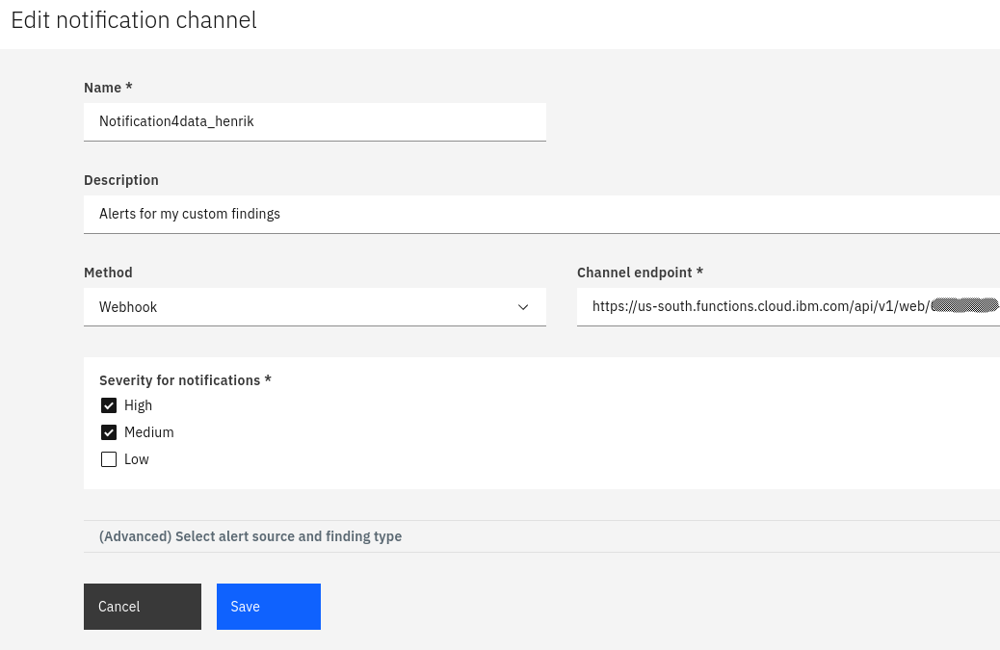

# IBM Cloud Security Advisor Notifications
The IBM Cloud Security Advisor allows to [configure notification channels](https://cloud.ibm.com/docs/services/security-advisor?topic=security-advisor-notifications). It means that whenever new issues are found (new findings), notifications are sent to qualifying channels. When setting up notification channels, you need to specify a webhook to receive the notification. You also configure for which security providers and for what severity level a notification should be posted to that channel.

In this repository, we provide Python code for IBM Cloud Functions / Apache OpenWhisk actions. They can be used to implement such a mentioned webhook to receive a notification and post a message to a Slack channel.

## Set up webhook and notification channel
In order to receive a notification from the security advisor, process it and post a message to Slack, you need to set up a couple components. This includes the Slack app to post messages, actions to receive a notification and post it to Slack as well as the notification channel in IBM Cloud Security Advisor. Follow the steps below.

#### Prepare
1. Download or clone this repository and change into the new directory.
2. [Download public key](https://cloud.ibm.com/security-advisor#/notifications) for notification channels and save it to a file `public.key`. The public key is needed to verify intactness of notification payloads. The code in action [receiveNotification.py](/src/receiveNotification.py) will work without, but it is recommended to verify objects.
3. [Create a Slack app](https://api.slack.com/start) and [use an incoming webhook](https://api.slack.com/messaging/webhooks) to send messages to Slack. Thereafter, [deploy the app to a Slack channel](https://api.slack.com/best-practices/blueprints/per-channel-webhooks), copy the displayed webhook. Save it to a file `webhook.uri`. It is needed when deploying the Cloud Functions actions.


#### Deploy
1. Make sure you are logged in to IBM Cloud on the command line and have targeted the right environment. You can use the command `ibmcloud target` to verify.
2. In the same terminal, execute the following command:
   ```
   SA_PUBLIC_KEY=$(cat public.key) SLACK_WEBHOOK_URL=$(cat webhook.uri) ibmcloud fn deploy
   ```
   It sets two environment variables based on the file content from the prepare phase above. The variables are used to bind action parameters. See the file [manifest.yaml](manifest.yaml) and the related action code for details.
3. Next, you need to obtain the URL for web-enabled action. It serves as webhook for the notification channel. Execute the following:
   ```
   ibmcloud fn action get security_notifications/handleNotification --url
   ```

#### Create notification channel
After setting up everything to receive a notification and to post it as message to Slack, now it is time to create and configure a notification channel in IBM Cloud Security Advisor:
1. In the browser, navigate to [**Notification channels** in the Security Advisor](https://cloud.ibm.com/security-advisor#/notifications).
2. Click **Add notification channel**. Fill in name, description, etc. For webhook, use the URL obtained in step 3 above. Add the ending `.json` to that URL to indicate the runtime that JSON data will be processed.
3. Click on **(Advanced) Select alert source and finding type** to filter events for which to receive notifications. You can pick from built-in and partner providers, the Configuration Advisor and [custom findings](https://github.com/data-henrik/security-advisor-findings).
4. Once done, click **Save**. This concludes the setup.



#### Test notifications
With all components set up, now you can test notifications.
1. In the browser and the [**Notification channels** page](https://cloud.ibm.com/security-advisor#/notifications), click on the three dot menu in the line showing the created channel. Select **Test connection**. This initiates sending a small test notification to the configured webhook.
2. Go to the Slack channel in which you deployed the app. Check for the message.
3. In the browser, navigate to the [IBM Cloud Functions dashboard](https://cloud.ibm.com/functions/dashboard). Select the region and namespace in which you deployed the actions. Check for action activations. Click on the activations to see details such as content or errors.


## Security Advisor custom findings

See the GitHub repo [data-henrik/security-advisor-findings](https://github.com/data-henrik/security-advisor-findings) for details and blog articles on how to integrate your own security scans and related objects (custom findings) into [IBM Cloud Security Advisor](https://cloud.ibm.com/security-advisor).

## License
See the file [LICENSE](/LICENSE) for details.